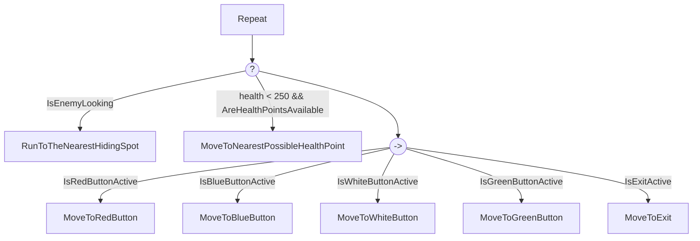

# IAV - Práctica 3: Decisión

## Autores
- Yi (Laura) Wang Qiu [GitHub](https://github.com/LauraWangQiu)
- Agustín Castro De Troya [GitHub](https://github.com/AgusCDT)
- Ignacio Ligero Martín [GitHub](https://github.com/theligero)
- Alfonso Jaime Rodulfo Guío [GitHub](https://github.com/ARodulfo)

## Propuesta
Este proyecto es una práctica de la asignatura de Inteligencia Artificial para Videojuegos del Grado en Desarrollo de Videojuegos de la UCM, cuyo enunciado original es este: [Robot a la Fuga](https://narratech.com/es/inteligencia-artificial-para-videojuegos/decision/robot-a-la-fuga/).

Esta práctica consiste en recrear un escenario en el que un robot `Néstor` debe encontrar la salida del espacio en donde se encuentra. Para ello, deberá buscar llaves para desbloquear puertas y, huir y esconderse entre otros `Robots` de un grupo de `Guardias` que intentan capturarlo y disparlo si está en sus campos de visión. Estos últimos, si no ven a `Néstor`, patrullan por el escenario siguiendo waypoints.

## Punto de partida

Se parte de un proyecto base de **Unity 2022.3.5f1** proporcionado por el profesor y disponible en este repositorio: [IAV-Robot](https://github.com/Narratech/IAV-Robot)

| Clases | Información |
| - | - |
| BasicRigidBodyPush | Clase que controla el empuje de un RigidBody. Se asigna una fuerza con un rango de entre 0,5 y 5 (empezando con valor de 1,1) y, si se activa, verifica primero que no se colisione con otro RigidBody cinemático, que se choque con la capa deseada y que no se colisione con objetos que se encuentren por debajo para a continuación calcular la dirección del empuje y aplicar la fuerza al receptor. |
| BehaviorExecutor | Definición del componente BehaviorExecutor dentro de Unity. Incluye métodos de comportamiento que se actualizan desde el editor, con funcionalidad adicionales para el modo de depuración. |
| Bullet | Componente utilizado para los proyectiles. Gestiona la colisión de estos con otros objetos. Si colisiona con un objeto con el componente `Health` le resta vida. En cualquier caso los proyectiles se destruyen al colisionar o pasados 2 segundos desde que se intanciaron. |
| Enemy | Inicializa los atributos y comportamientos comunes a los Guardias: navegación por el entorno, árboles de comportamiento, salud y animaciones. |
| Health | Componente de vida del jugador. Tiene variables para la vida actual y la vida máxima con métodos para devolver el valor mínimo, máximo y el actual. Además, permite aplicar daño o resetear la vida de éste. |
| LaserShooter | Gestiona el disparo de los enemigos. Contiene variables para las balas, velocidad, cooldown y punto al que disparar. En su método `Shoot()` se instancian las balas desde el punto de disparo hacia un punto especificado o hacia delante. |
| PlayerInput | Esquema que mapea las acciones del jugador con botones de teclado, ratón y gamepad. |
| ResetPlayer | Reestablece la posición y rotación del jugador y de la cámara. |
| StarterAssetsInputs | Establece los valores de input: move, look, jump, sprint, crouch, shoot, interact que representan el estado del jugador en escena. |
| ThirdPersonController | Recoge todos los apartados necesarios para el satisfactorio control de una entidad en tercera persona. Realiza las labores de: salto y caída con representación de la gravedad determinada, comprobación de que la entidad se encuentra con los pies en la tierra, comprobación de que la entidad puede dejar de estar agachada y mueve la entidad en una dirección establecida a través de la rotación y la velocidad de la entidad. |
| ToggleBarrier | Corrutina que se encarga de cambiar el parámetro alpha de los mesh de los láseres de las barreras durante un tiempo predeterminado para representar su activación o desactivación. |
| Waypoint | Clase base que sive como almacenamiento para un punto de ruta que seguirá una entidad guiada por IA. |

## Diseño de la solución

C. El planteamiento del ejercicio es hacer una máquina de estados en la que se hallen distintas fases por las que los robots pasen en su comportamiento. En primer lugar habrá una fase de patrulla, donde el robot seguirá una serie de puntos de forma cíclica. Si se encontrase con `Nestor` (es decir, que entre en su cono de visión durante la patrulla), el robot pasará a una fase de seguimiento y disparo donde, mientras siga estando en dicho cono, seguirá siguiendo y disparando hasta acabar con él. Dentro del propio seguimiento hay momentos de recálculo del porcentaje de acierto y/o daño que se le puede hacer, pero siempre se vuelve rápidamente al estado de seguimiento y disparo. Pueden darse a partir de ahí dos casos distintos: o bien pierde a `Nestor` de vista y tiene que volver a la base a volver a realizar la patrulla o bien se queda sin munición y tiene que volver a la base para recargar. En éste último, el robot tiene que hacer todo el recorrido de vuelta independientemente de su posición actual. En el otro caso de pérdida de vista, el robot tendrá que localizar el punto de la patrulla más cercano y volver de nuevo a hacer la patrulla.

Todos estos estados se pueden ver bastante visualmente gracias al siguiente diagrama de estados:


```
class StateMachine:
    # We’re in one state at a time.
    initialState: State
    currentState: State = initialState

    # Checks and applies transitions, returning a list of actions.
    function update() -> Action[]:
        # Assume no transition is triggered.
        triggered: Transition = null

        # Check through each transition and store the first
        # one that triggers.
        for transition in currentState.getTransitions():
            if transition.isTriggered():
                triggered = transition
                break

        # Check if we have a transition to fire.
        if triggered:
            # Find the target state.
            targetState = triggered.getTargetState()

            # Add the exit action of the old state, the
            # transition action and the entry for the new state.
            actions = currentState.getExitActions()
            actions += triggered.getActions()
            actions += targetState.getEntryActions()

            # Complete the transition and return the action list.
            currentState = targetState
            return actions

        # Otherwise just return the current state’s actions.
        else:
            return currentState.getActions()
```


```
class State:
    function getActions() -> Action[]
    function getEntryActions() -> Action[]
    function getExitActions() -> Action[]
    function getTransitions() -> Transition[]
```

```
class Transition:
    function isTriggered() -> bool
    function getTargetState() -> State
    function getActions() -> Action[]
```

D. En este apartado se nos pide que con BehaviorBricks `Néstor` escape del **Nivel 2**. Para ello vamos a implementar el siguiente árbol de comportamientos:



**Es importante conseguir todos los botones en ese orden para poder salir del nivel y, aunque para el caso de los botones rojo y azul puede variar el orden, conviene que primero sea el rojo y luego el azul para que sea el camino más rápido por la disposición de la escena.**

La idea es que siempre se compruebe si el enemigo está mirando a `Néstor` y si su vida es menor de cierto valor, en este caso, 250. Mientras no se cumpla ninguna de estas condiciones, `Néstor` debe intentar conseguir los botones que desbloquean las puertas. Si no hay botones activos, debe dirigirse a la salida porque ya ha conseguido todas las llaves y ha desbloqueado todas las puertas.

- Si el/los enemigo/s está/n mirando a `Néstor`, `Néstor` debe huir a un punto de escondite más cercano para perderlo/s de vista y volver a intentar conseguir los botones que desbloquean las puertas.

- Si la vida de `Néstor` es menor de cierto valor y dependiendo de si puede llegar hasta un punto de curación, `Néstor` irá al punto más cercano para curarse.

Como se puede intuir, esto es un árbol de comportamientos *hardcodeado*, por lo que no es muy flexible y solo se puede aplicar a este caso en concreto.

E. ...

```pseudo

```

## Pruebas y métricas

| Pruebas | Métricas | Links |
|:-:|:-:|:-:|
| **Característica A** | | |
| Comprobar la correcta representación del esquema con la topología del complejo militar incluyendo todos los elementos incluidos en este (Néstor, Cápsulas de Energía, botones, guardias y escondites) y el correcto zoom y seguimiento de la cámara a _Néstor_  | - Ejecución del programa y movimiento del jugador para inspeccionar el mapa<br> - Pulsaciones consecutivas de la tecla Z para opbservar el correcto funcionamiento del mismo. | []() |

| Pruebas | Métricas | Links |
|:-:|:-:|:-:|
| **Característica B** | | |
| Probar el correcto bloqueo de la visibilidad de _Néstor_ al encontrarse tras una puerte cerrada o abierta y en el interior de un montón de robot. | -Colocarse tras una puerta cerrada. <br> - Colocarse tras una puerta abierta. <br> - Colocarse en el interior de un montón de robots, entrar y salir mientras _Néstor_ se encuentra en el cono de visioón de un robot.  | []() |

| Pruebas | Métricas | Links |
|:-:|:-:|:-:|
| **Característica C** | | |
| Probar que el comportamiento de los robot es el descrito en la máquina de estados asignada a los mismos. | - Entrar en el cono de visión de un robot y observar que te sigue. <br> - Alejarte y acercarte y observar el empeoramiento/mejoría de la puntería. <br> - Aguantar los disparos necesarios para que se agoten y observar que vuelve a su base para recargar. <br> - Desaparecer del cono de visión del robot y observar que vuelve al Waypoint más cercano.  | []() |
|  | - <br> - | []() |

| Pruebas | Métricas | Links |
|:-:|:-:|:-:|
| **Característica D** | | |
|  | - <br> - | []() |
|  | - <br> - | []() |

| Pruebas | Métricas | Links |
|:-:|:-:|:-:|
| **Característica E** | | |
|  | - <br> - | []() |
|  | - <br> - | []() |

[ENLACE AL VÍDEO COMPLETO EN YOUTUBE]()
[ENLACE AL VÍDEO COMPLETO EN DRIVE]()

## Ampliaciones

No se han realizado ampliaciones.

## Producción

Las tareas se han realizado y el esfuerzo ha sido repartido entre los autores. Observa la tabla de abajo para ver el estado y las fechas de realización de las mismas. Puedes visitar nuestro proyecto de GitHub en el siguiente [link](https://github.com/orgs/IAV24-G02/projects/3/).

| Estado  |  Tarea  |  Fecha  |  
|:-:|:--|:-:|
|  | Diseño: Primer borrador | ..-04-2024 |
|  | Característica A | 10-04-2024 |
|  | Característica B | ..-04-2024 |
|  | Característica C | ..-04-2024 |
|  | Característica D | ..-04-2024 |
|  | Característica E | ..-04-2024 |
|  |  **OTROS**  | |
|  |  | ..-04-2024 |
|  |  **OPCIONALES**  | |
|  |  | ..-04-2024 |

## Licencia

Yi (Laura) Wang Qiu, Agustín Castro De Troya, Ignacio Ligero Martín, Alfonso Jaime Rodulfo Guío, autores de la documentación, código y recursos de este trabajo, concedemos permiso permanente a los profesores de la Facultad de Informática de la Universidad Complutense de Madrid para utilizar nuestro material, con sus comentarios y evaluaciones, con fines educativos o de investigación; ya sea para obtener datos agregados de forma anónima como para utilizarlo total o parcialmente reconociendo expresamente nuestra autoría.

Una vez superada con éxito la asignatura se prevee publicar todo en abierto (la documentación con licencia Creative Commons Attribution 4.0 International (CC BY 4.0) y el código con licencia GNU Lesser General Public License 3.0).

## Referencias

Los recursos de terceros utilizados son de uso público.

- *AI for Games*, Ian Millington.
- [Liquid Snake](https://ceur-ws.org/Vol-3305/paper7.pdf)
- Unity Asset Store: [Behavior Bricks](https://assetstore.unity.com/packages/tools/visual-scripting/behavior-bricks-74816)
